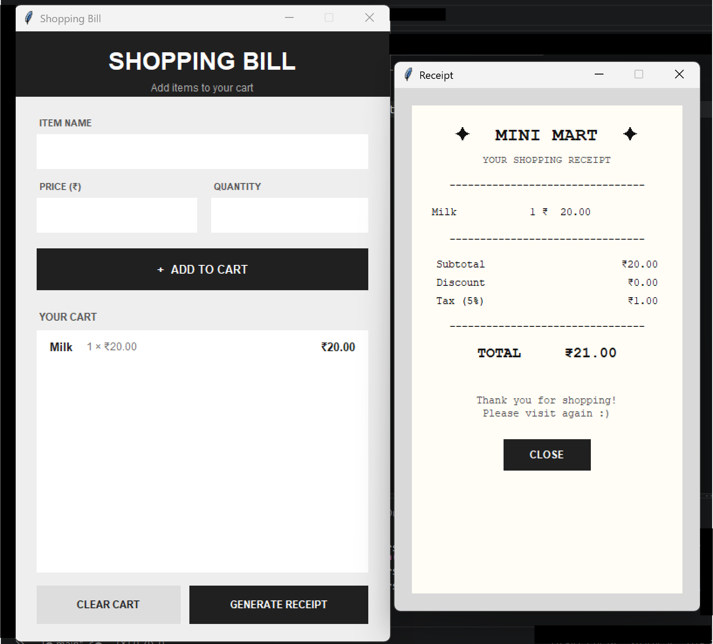

# 🛒 Shopping Bill Calculator

> A simple Python shopping app that turns a list of items into a receipt-style bill.

## ✦ About

**Shopping Bill Calculator** is a beginner-friendly Python project where users can add products, set their prices and quantities, and generate a final shopping receipt.

The final bill appears in a **receipt-style interface**, similar to a small store billing machine.

## 🧾 Preview

  

## ✨ Features

- 🛍️ Add items to cart
- 💰 Enter price and quantity
- 🧺 View cart
- 🗑️ Clear cart
- 🧾 Generate a receipt
- 🎟️ Automatic discount calculation
- 💸 5% tax calculation
- 🧮 Automatic total calculation
- 🖥️ Simple graphical interface

## 🛠️ Built With

- Python
- Tkinter

No external libraries are required.

## 📚 What I'm Learning

This project helped me practice:

- **Lists & Dictionaries** — storing and organizing shopping data
- **Functions** — breaking the program into smaller parts
- **Classes & Objects** — using basic Object-Oriented Programming
- **Loops** — displaying multiple items
- **Conditions** — handling discounts and different situations
- **User Input** — taking product information
- **Arithmetic** — calculating prices, discounts, tax and totals
- **Tkinter** — creating a graphical user interface
- **Event Handling** — connecting buttons to different actions
- **Data Management** — adding and clearing items
- **String Formatting** — creating a receipt-like layout

## 💡 Discount Rules

    ₹1000+  →  5% discount
    ₹2000+  → 10% discount

A **5% tax** is then calculated after the discount.

## ▶️ How to Run

Make sure Python is installed.

Run:

    python shopping_bill.py

## 📁 Project Structure

    shopping-bill-calculator/
    │
    ├── shopping_bill.py
    ├── README.md
    │
    └── assets/
        └── shopping-bill-preview.png

## 🌱 Project Goal

The goal of this project was to practice combining Python concepts into a small application while learning how a basic billing system works.

---

`code it • calculate it • print the receipt`

